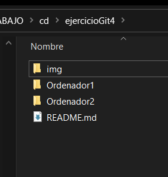
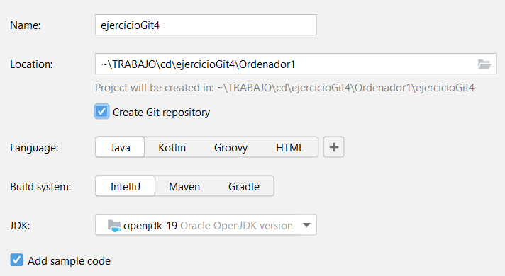
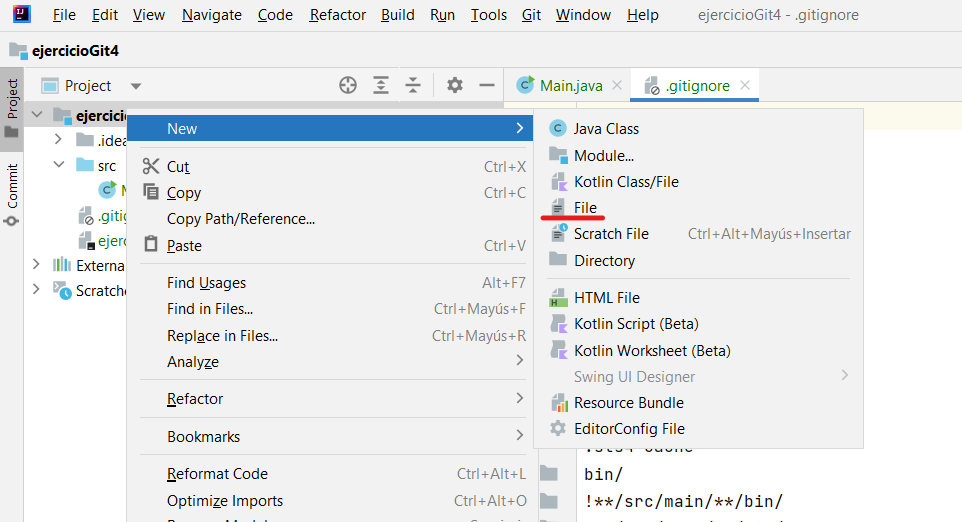
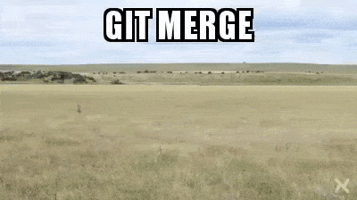

# EjercicioGit4

*NOTA: Completad añadiendo tantos pasos y capturas como se considere necesario.*  
*NOTA: Los comandos de Git deben indicarse con capturas de pantalla y no con fragmentos de código.*

1. Creamos una carpeta de trabajo con:
    - Dos carpetas (**Ordenador1** y **Ordenador2**), que simularán dos equipos remotos.
    - Este README.md para ir editándolo y creando el registro de trabajo con capturas.
    - Una carpeta "img" para las imágenes que serán referenciadas desde el README  
     
  
2. Creamos un repositorio vacío (sin README ni gitignore) en GitHub.  

3. Creamos un proyecto de IntelliJ en **Ordenador1** con repositorio de Git y código de ejemplo.
    

4. Creamos un nuevo README.md localmente (no el presente con el registro de trabajo, que se añadirá al final sustituyendo a ese.)
    

5. Realizamos un primer commit y push de la base del proyecto.  
*NOTA: ved mi log para comprobar que hacéis commits idénticos a los míos.*

6. Clonamos el proyecto dentro de **Ordenador2** y lo abrimos.

7. Creamos una nueva funcionalidad, para lo cual creamos una rama "feat_persona" y la desarrollamos (ver mi log de commits). Una vez lista subimos la rama (```git push feat_persona```). Después, nos movemos a master para hacer un merge de "feat_persona" **localmente**. Al no haber nuevos commits en master, el merge debería ser automático y sin conflictos. Después del merge, hacemos un push de master con los nuevos cambios añadidos.

8. Volvemos a **Ordenador1**. Recordamos el estado de nuestro proyecto en este ordenador haciendo un ```git status``` y un ```git log```. Si no nos indica que el master local está por detrás del remoto (origin/master), será necesario hacer un ```git fetch```.

9. Para poder seguir trabajando desde **Ordenador1**, deberíamos hacer antes de nada un pull para traernos el nuevo commit que tiene master en remoto. Sin embargo, vamos a probar qué sucedería si nos olvidamos de ello.

10. Desarrollamos una nueva funcionalidad "feat_empleado" en su correspondiente rama.

    1. Durante el desarrollo, antes de hacer el primer commit en feat_empleado, detectamos que el fichero .idea/workspace.xml cambia automáticamente a menudo al abrir el proyecto en IntelliJ (es un archivo de metadatos de proyecto de IntelliJ).

    2. Hacemos un primer commit para añadir ```.idea/workspace.xml``` al .gitignore. Además, como los ficheros de ese directorio ya se han añadido previamente al repositorio, tendremos que eliminarlos de él haciendo:

        ```bash
        git rm --cached .idea/workspace.xml
        ```

    3. Hacemos los otros 2 commits y pusheamos.

    4. Vemos todas las ramas que tenemos.

        ```bash
        git branch -a
        ```

        feat_persona solo debería estar en remoto, ya que es una rama que no se ha usado en este "ordenador".

    5. Hacemos un checkout a master para mergear. Al hacer el push detectamos que hay un conflicto. Hemos olvidado de descargarnos los cambios que habíamos hecho en el otro ordenador y que tenemos subidos a GitHub.

    6. Podríamos hacer un pull, que implicaría un merge de la rama remota a la rama local, como ya hemos visto, pero para hacerlo bien, vamos a eliminar los nuevos commits de master (siguen en feat_empleado, así que no se pierden). Para ello, usamos un ```git reset --hard``` desde master, volviendo al último commit común al master remoto.

    7. Ahora sí podemos hacer un pull de master sin conflicto.

    8. Hacemos merge de la nueva rama local feat_empleado. Ahora sí tendremos conflicto.

        

        Solventamos los conflictos (en Main.java) y como realmente se está abordando la misma funcionalidad, lo llevamos más allá y dejamos una versión funcional con lo que queremos quedarnos de cada rama (ver en mi log).

    9. Terminamos el merge con add y commit, y hacemos un push.

11. Volvemos a Ordenador2 y comprobamos si tenemos todo al día con ```git status``` y ```git log```. Si no nos indica que el master local está por detrás del remoto, será necesario hacer un ```git fetch```, que ahora nos indicará que debemos hacer un pull.

12. Ahora vamos a simular cómo se desarrollaría en paralelo en varias ramas (distintas personas). No crearemos carpetas que simulen ordenadores pero cada rama representará el trabajo independiente de cada componente del equipo de trabajo.

    1. Creamos dos ramas desde master, que desarrollaremos sin hacer merge a master (simulando otro desarrollador trabajando en paralelo): 
        1. "feat_inmutable_fields" para evitar que se pueda cambiar el nombre y la fecha de contratación de un empleado (asumimos que las especificaciones del proyecto lo impiden, sea o no razonable).
        2. "bug_edad_negativa", para garantizar que la edad de un empleado no pueda ser negativa.

    3. Una vez desarrolladas, hacemos el merge de ambas ramas a master solventando conflictos.

13. Realizamos otras mejoras en la rama feat_deprecated_data_type para solucionar los problemas de la librería obsoleta java.util.Date, y los mergeamos.
